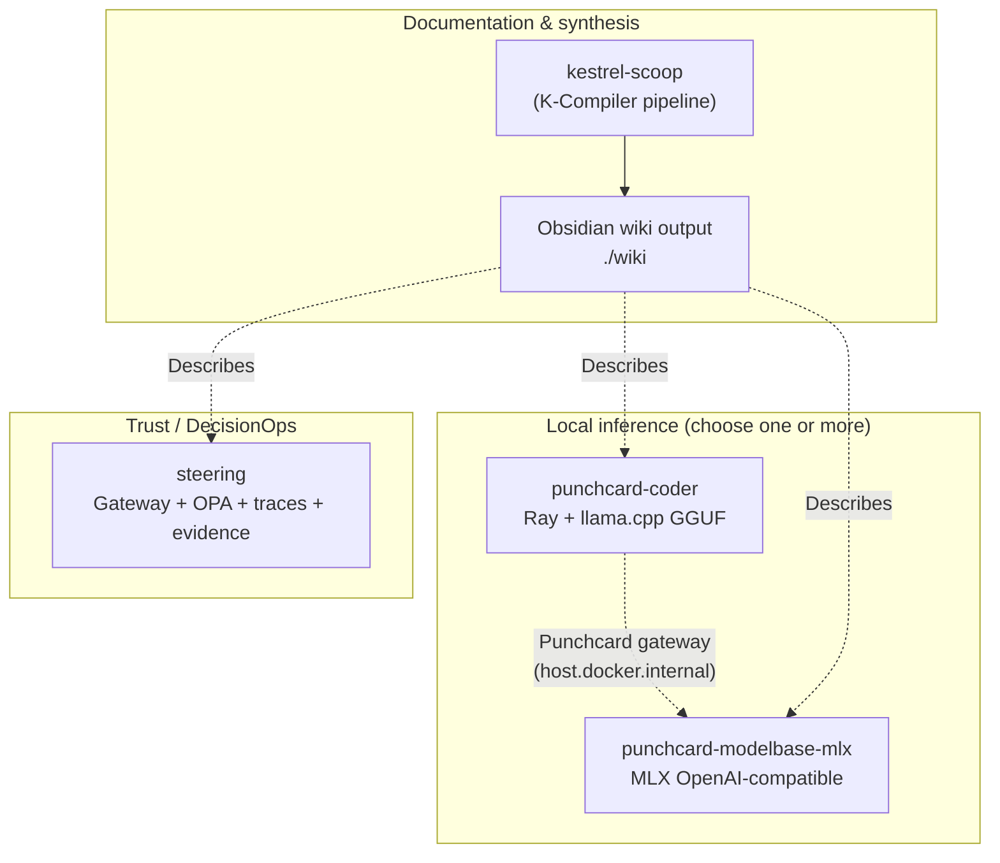

---
tags:
  - strategic-view
  - integration
  - architecture
last_updated: 2026-04-05
---

# Ecosystem integration analysis

Synthesis of how **kestrel-systems** and **trust-systems** repositories fit together as documented in markdown today, and how a reasonable operator would **use them together**.

## Layered mental model

- **kestrel-scoop** does not run inference or policy; it **aggregates and compiles** markdown from configured trees into this vault.
- **punchcard-coder** and **punchcard-modelbase-mlx** are **alternative local inference substrates** with different runtimes; integration is **HTTP contracts + Punchcard routing**, not shared libraries in these repos.
- **steering** implements a **decision → trace → evidence** chain; it is **parallel** to the coding-assistant stack unless you **design** a bridge (e.g. wrap privileged actions with `/decide`).

## Documented touchpoints

| From | To | What the docs say |
|------|-----|---------------------|
| punchcard-modelbase-mlx | Punchcard (external repo) | OpenAI-compatible `/v1`, Service/Ingress to `host.docker.internal`, stable model aliases in `configs/models.yaml`. |
| punchcard-coder | Punchcard platform | Overlay generation, `make deploy-coder`, Traefik routes to Ray Serve; optional external Ray on host. |
| kestrel-scoop | kestrel-systems, trust-systems, artemis_home, repo_strategy | `config.yaml` projects crawl `**/*.md` for synthesis into `./wiki`. |
| steering | Local / kind demos | `scripts/demo_local.sh`, `make kind-demo`; OPA + gateway + worker + schemas. |

## Using them together (practical scenarios)

1. **Docs + local MLX**: Run [[punchcard-modelbase-mlx]], point Punchcard (where you host it) at `:8000/v1`; use [[kestrel-scoop]] to keep this vault current from the same monorepo checkout.
2. **Docs + coder workload**: Deploy [[punchcard-coder]] per its docs; observability URLs (`grafana.localtest.me`, etc.) are **parallel** to steering’s OTel stack—**no unified dashboard** is specified across repos.
3. **Trust envelope for automation**: For actions that must be **policy-gated** and **auditable**, [[steering]]’s Decision Trace + Evidence model is the natural fit; **generative** endpoints in Punchcard do not automatically emit steering events unless integrated.

## Cross-repo dependencies (documentation level)

- **punchcard-coder** references a separate **punchcard** repository (Helmfile, overlays)—not vendored under `artemis/` in this workspace snapshot.
- **kestrel-scoop** references **`../../artemis_home`** and **`../../repo_strategy`**—may or may not exist beside `artemis/` on your machine.

See [[02_Strategic_Views/Gaps_and_Opportunities]] for missing links and next documentation steps.
